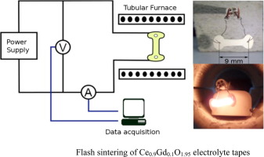

# Setup para la medición con este repositorio

En este documento se detalla el setup del experimento.
por favor implemente este setup para a ejecución de este repositorio.

El setup es para observar el comportamiento eléctrico en un horno tubular como en el siguiente esquema.

* el horno tubular es XXXXXX
* La fuente de poder es XXXXXXXX
* el voltimetro a usar es Tektronix DMM 4050
* el amperimetro a usar es un Keithley 2110
